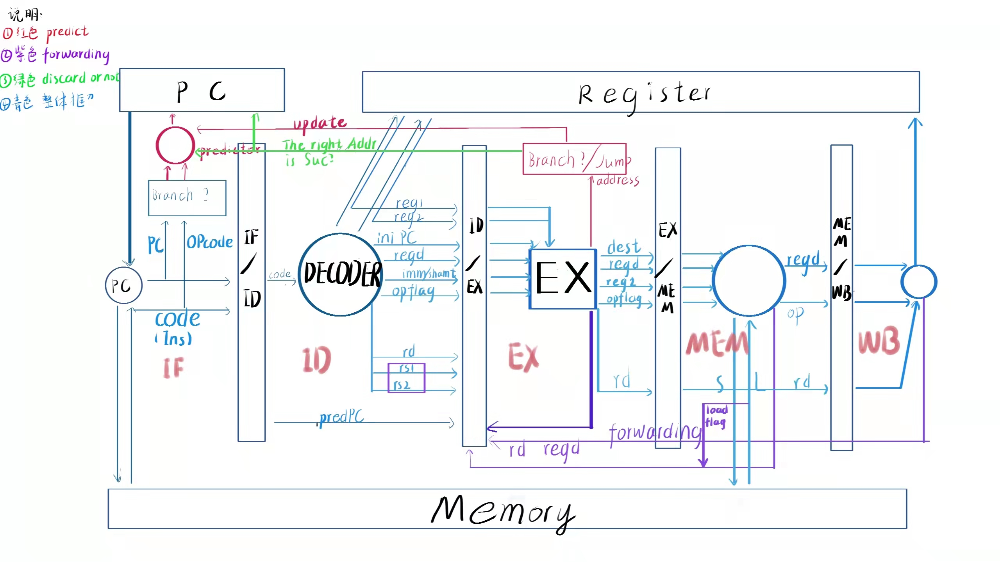

# RISC-V-simulator

## 简介
- *2021-2022 6.20-7.3*
- 上海交通大学**PPCA** `Principle and Practice of Computer Algorithm`课程项目
- **使用 C++ 模拟基于RISC=V指令集的CPU五级流水**

## 五级流水设计示意图

## 缩写说明

- 阶段名称缩写说明

| 缩写    | 全称               |
| ------- | ------------------ |
| **IF**  | Instruction Fetch  |
| **ID**  | Instruction Decode |
| **EX**  | Execute            |
| **MEM** | Memory Access      |
| **WB**  | Write Back         |

- 变量缩写说明

| 缩写       | 全称                 | 说明                     |
| ---------- | -------------------- | ------------------------ |
| **OPCODE** | Operation Code       |                          |
| **RD**     | Register Destination | 将写入的寄存器序号       |
| **IMM**    | Immediate            | 立即数,imm or shamt     |
| **PC**     | Program Counter      | 待执行的下一条指令地址   |
| *iniPC*       | Initail PC  | 指令初始取址位置             |
| *predPC*       | Predicted PC  | 该指令（预测）的下一个取址位置             |
| *code*    | Insturction          | 32位指令                |
| *opflag*| Operation Flag| 枚举类型用于区分37种指令|
| *RS*     | Register Source      | 读取值的寄存器序号,rs1,rs2       |
| *regd,reg1,reg2*| Register Value       | 获取的寄存器值,分别对应reg[rd],reg[rs1],reg[rs2]           |

## 五级流水测试情况

- 五阶段顺序自测样例已通过
- 五阶段顺序OJ测试已通过
- 五阶段乱序自测已完成
- 五阶段乱序OJ测试已完成

## 文件结构

### **main.cpp**
main函数:
- `init()`
### **global.hpp**
- global variables
    - `PC` `mem[500000]` `reg[32]` `clk` `virtual_clk` `eesc`
- enum:
    - `OPflag`  `object_num`
- buffer definitions
    - `IF_EX / ID_EX / EX_MEM / MEM_WB`buffer
- debug print function
    - `printOP()` `printREG()` `printSTORE()` `printID_EX_buffer()`

### **cpu.hpp**
- class cpu:
    - `cpu()` `~cpu()`
    - `init()`
    - `pipeRUN()` 

### **stages.hpp**
- *namespace STAGE*
    - five stages
        - `IF()` `ID()` `EX()` `MEM()` `WB()`
    
    - forwarding
        - preforwarding
            - `Epreforwarding()` `Mpreforwarding()` `Wpreforwarding()`
            - `forwarding()`

    - update
        - result buffer update
            - `RES_XX_buffer_up()`
        - put the result buffer to the real buffer    
            - `updateALL()`

### **predictor.hpp**
- class predictor
    - variables
        - for predicting : *BHT*  *PHT*  *BTB*
        - for the predictint result : *suc*  *cnt*
    - functions
        - `predictor()` `~predictor()`
        - `predict()` for predicting
        - `update()` for updating

**二级分支预测介绍以及预测结果展示**
- 介绍
    - 说明 取 **PC后9位**为索引下标
    - 数据成员
        - `BHT[512]` branch history table.记录PC对应的历史状态，对同一PC值，至多记录64种状态，即*6位*
        - `PHT[512][64]` Patern history table.每一个PC对应的历史状态所对应的跳转情况，是**二位饱和计数器**，分为`00` `01` `10` `11`四种状态，分别对应 `Strongly not taken` `Weekly not taken` `Weekly taken` `Strongly taken`,*PHT* >= 2表示需要跳转
        - ` BTB[512]` Branch target buffer.目标预测跳转地址
    - 基本过程
        - 在 `IF` 阶段进行分支预测,通过`PC`获取当前历史状态`BHT`,进而获取当前预测跳转状态`PHT`,如果(指令为 `Branch` 型 *&&* 相应*PHT* >= 2) 则跳转，跳转地址为 `PC + BTB `
        - 在`EX` 阶段对跳转结果以及预测正确性进行回传，通过 `isBranchTaken`以及`jump Address` `PC` 对`BHT(历史状态)` `PHT(预测跳转状态)` `BTB(预测跳转地址)`进行更新

- 结果展示

| 数据点 | 成功率 | 预测成功次数 | 预测总次数 |
| :----: | :----: | :----: | :----: |
|array_test1|50.00%|11|22|
|array_test2|46.15%|12|26|
|basicopt1|99.22%|153926|155139|
|bulgarian|94.64%|67659|71493|
|expr|81.98%|91|111|
|gcd|63.33%|76|120|
|hanoi|99.05%|17291|17457|
|lvalue2|66.67%|4|6|
|magic|85.14%|57785|67869|
|manyarguments|80.00%|8|10|
|multiarray|54.94%|89|162|
|naive|无|0|0|
|pi|84.45%|33742485|39956380|
|qsort|96.76%|193572|200045|
|queens|81.06%|62508|77116|
|statement_test|62.87%|127|202|
|superloop|99.25%|431781|435027|
|tak|80.53%|48832|60639|
